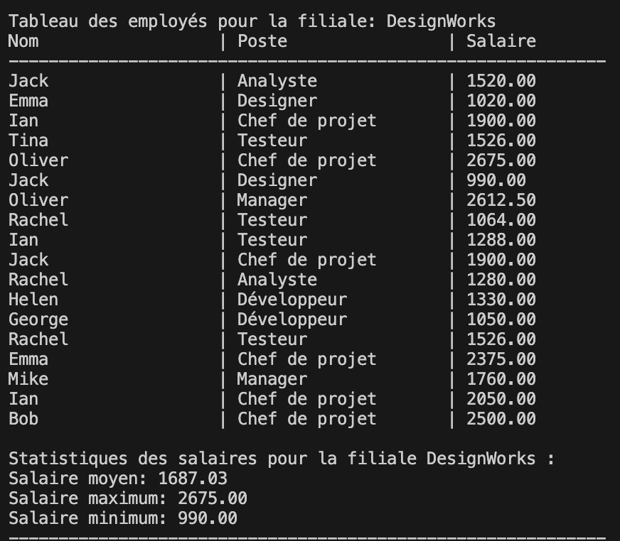
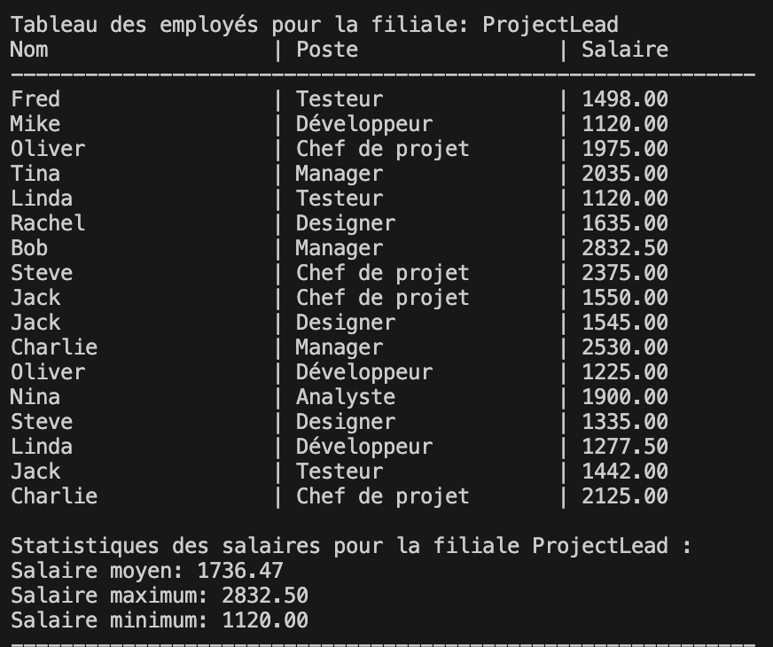
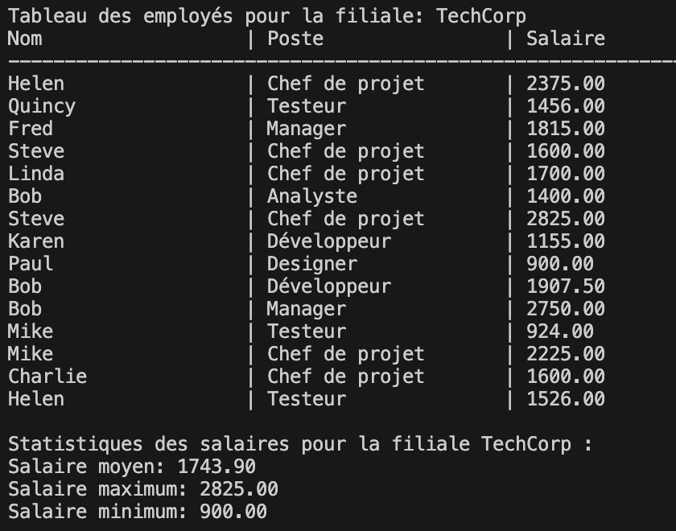
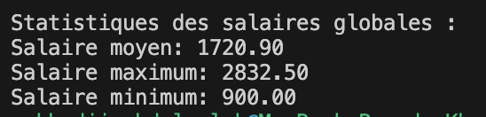

# monthly_salary_simplon

# Calcul des Salaires Mensuels dans une Entreprise avec plusieurs filiales

## Contexte du projet

Vous travaillez avec le service comptable d'une entreprise qui possède plusieurs filiales. Chaque filiale emploie entre 15 et 20 employés. La direction souhaite automatiser le calcul des salaires mensuels des employés en tenant compte des heures supplémentaires et obtenir des statistiques salariales pour optimiser la gestion des ressources humaines.  
Les données des employés sont fournies dans un fichier JSON qui contient toutes les informations nécessaires : nom, poste, taux horaire, heures travaillées, heures contractuelles, pour chaque employé des filiales.

## Conseils
- Planifiez votre travail : répartissez le temps entre les différentes tâches.
- Testez régulièrement votre code pour valider chaque étape.
- Soignez la qualité du code : commentaires, docstrings, annotations de type.
- Soignez l'affichage des résultats dans la console pour qu'ils soient agréables à lire.
- N'hésitez pas à innover : des solutions créatives sont les bienvenues.

## Modalités pédagogiques

### 1. Importation et Préparation des Données
- Charger le fichier JSON fourni contenant les informations des employés.

### 2. Calcul des Salaires Mensuels
- Pour chaque employé, calculer le salaire mensuel en tenant compte des heures supplémentaires.
- Les heures supplémentaires sont rémunérées à un taux majoré (1,5 fois le taux horaire normal) au-delà des heures contractuelles.
- Les heures contractuelles peuvent varier d'un employé à l'autre.
- Faites x4 semaines pour obtenir le salaire mensuel.

### 3. Calcul des Statistiques Salariales
- Calculer les statistiques globales pour l'ensemble de l'entreprise :
  - Salaire moyen
  - Salaire le plus élevé
  - Salaire le plus bas
- Calculer les mêmes statistiques pour chaque filiale.

### 4. Affichage des Résultats
- Présenter les résultats de manière claire et lisible dans la console :
  - Les salaires mensuels de chaque employé avec leur nom et poste.
  - Les statistiques salariales globales et par filiale.
- Utiliser des messages formatés et structurés pour faciliter la lecture (espaces, indentations, etc.).

### 5. Qualité du Code
- Le code doit être parfaitement commenté.
- Utiliser des docstrings pour décrire les fonctions (inclure les entrées, les sorties, le rôle de la fonction).
- Utiliser des annotations de type (type hints) pour améliorer la lisibilité et la maintenance du code.
- Respecter les bonnes pratiques de nommage et de structuration du code.

## OUTPUT

